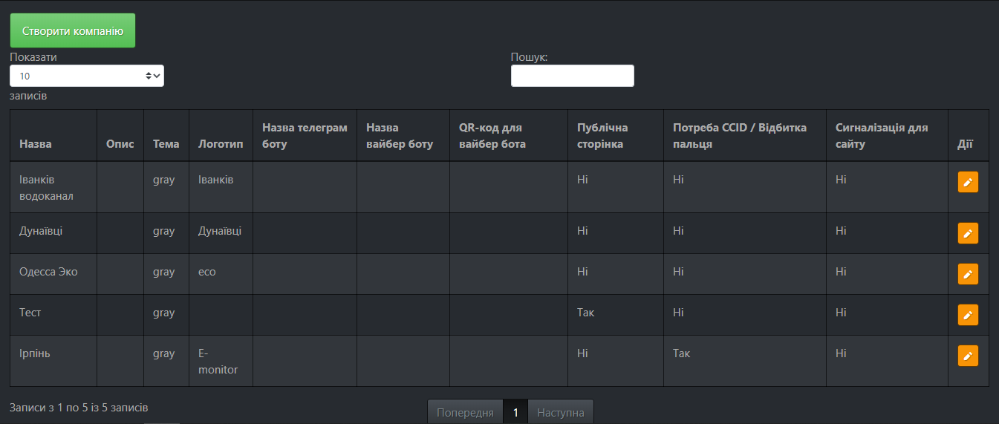
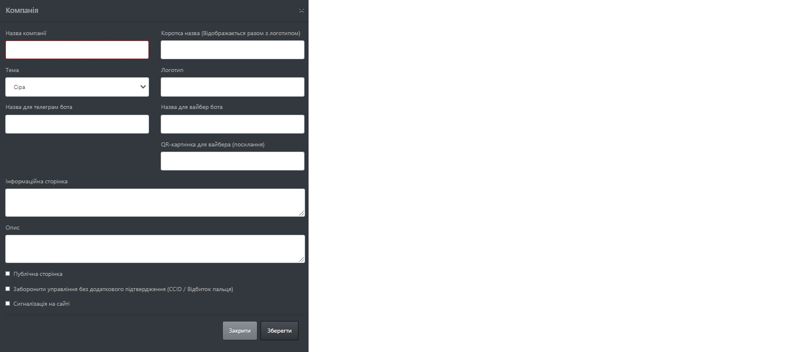

# Налаштування

Меню налаштувань розбито на наступні підпункти:

* [`Компанії`](/settings/#_2) - налаштування компаній на даному сервері, має доступ тільки [Супер Адмін](/#_3)
* `Станції` - налаштування станцій поточної компанії.
* `Групи` - налаштування груп моніторингу
* `Похідні параметри` - налаштування похідних параметрів(не справжні параметри, створені в результаті певних обчислень)
* `Таблиці` - налаштування таблиць з розділу [аналітика](/analytics/#_3)
* `Схеми` - налаштування схем з розділу [аналітика](/analytics/#_5)

## Компанії

Відображає таблицю з даними про компанії, дає можливіть створювати нові та редагувати існуючі компанії.

1. При натисканні на кнопку `Створити компанію` вікриється наступне вікно

**Поля:**

* `Назва компанії` - повна назва компанії відображається у описі;
* `Коротка назва` - коротка назва, відображається поруз з логотипом компанії;
* `Тема` - кольорова тема компанії. Сайт має кілька тем. Вони міняю забарвлення і деякі зображення. Застосована тема діє на всіх користувачів компанії;
* `Логотип` - логотип компанії, що відображається з назвою, можна вибрати серед існуючих чи завантажити свій;
* `Назва для телеграм бота` - назва боту в Telegram;
* `Назва для вайбер бота` - назва боту в Viber;
* `QR-картинка для вайбера (посилання)` - посилання на Viber бота;
* `Інформаційна сторінка` - інформація, що відображається при кліку на пікторнаму компанії в меню;
* `Опис` - Опис компанії інформація для Супер Адміна;
* `Публічна сторінка` - коли вибрано, створиться посилання на публічну сторінку з показниками в групах;
* `Заборонити управління без додаткового підтвердження (CCID / Відбиток пальця)` - коли вибрана дана опція, будь-яка дія з розділу керування потребуватиме верифікації відбитку пальця чи використання спеціального цифрового носія;
* `Сигналізація на сайті` - при виході параметрів за межі, на сайті ввімкнеться звукове сповіщення про подію

При натисненні кнопки [edit](/img/common/edit.png) у таблиці, відкриється вікно редагування вибраної компанії, вікно редагування має всі ті ж поля, що описано вище.
